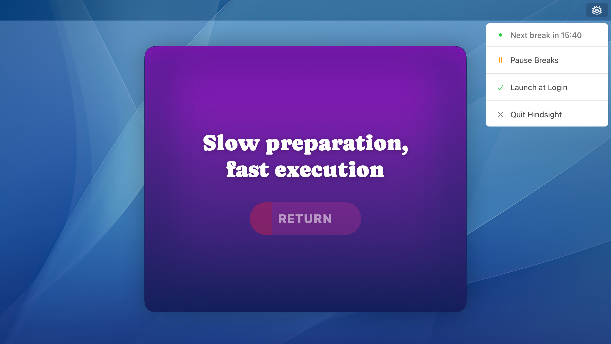

# Hindsight



This MacOS app helps you rest your eyes following the 20/20/20 rule—reminding you to look away from your screen every 20 minutes for 20 seconds at something 20 feet away. Instead of a simple timer, it features Brian Eno's *Oblique Strategies*, offering prompts to shift your perspective and reset your focus. Give your eyes a break, and let your mind wander.

## Features

- Unobtrusive menu bar presence
- Regular break reminders
- Break modal featuring *Oblique Strategies*
- Launch at login option
- Pause/resume functionality

## Requirements

- macOS 11.0 or later
- Xcode 14.0 or later (for development)

## Installation

1. Clone the repository:
```bash
git clone https://github.com/davidsizemore/hindsight.git
```

2. Open the project in Xcode:
```bash
cd hindsight
open Hindsight.xcodeproj
```

3. Archive the project:
   - Select "Product > Archive" from the Xcode menu
   - In the Archives window, select the latest archive
   - Click "Distribute App"
   - Choose "Copy App" and select a location (like your Desktop)
   
4. Install the app:
   - Drag the exported Hindsight.app to your Applications folder
   - Launch Hindsight from your Applications folder

## Usage

- Click the menu bar icon to see your next break time
- Use the menu to pause/resume breaks
- When a break occurs, take a moment to reflect on the displayed strategy
- Click "RETURN" after the waiting period to dismiss the break

## Credits

The app uses Brian Eno's *Oblique Strategies* as prompts for reflection during breaks.
